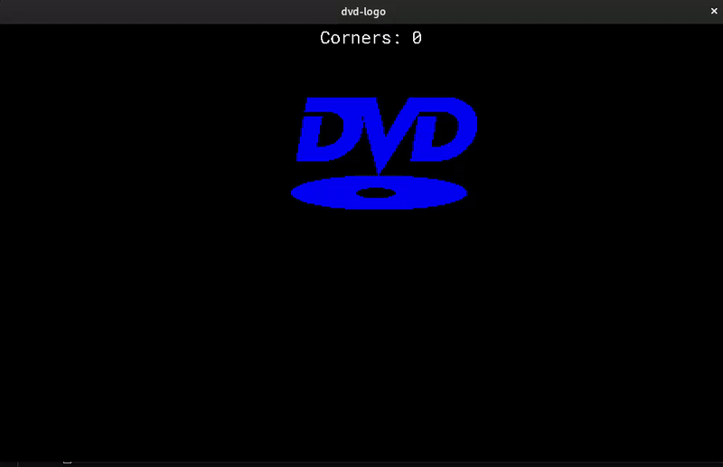

# DVD logo simulator

This project simulates classic DVD logo bouncing on the screen. Program counts how many times the logo has hit the corner.

## Getting started
In order to run the project make sure you have SDL2 installed. Then, simply run `make` in the project directory to compile.

## Demo

## Contributing

1. Fork the Project
2. Create your Feature Branch (`git checkout -b feature/AmazingFeature`)
3. Commit your Changes (`git commit -m 'Add some AmazingFeature'`)
4. Push to the Branch (`git push origin feature/AmazingFeature`)
5. Open a Pull Request

## License

Distributed under the MIT License. See `LICENSE` for more information.
